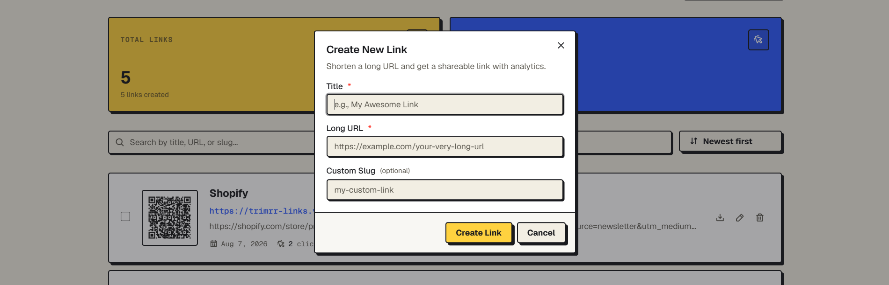
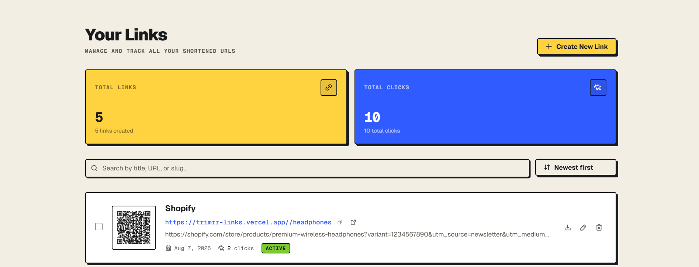
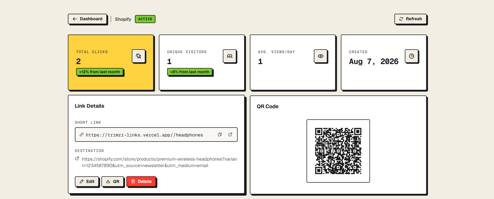
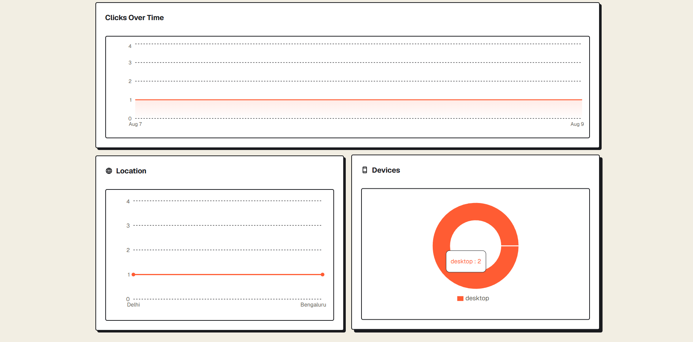

# Trimrr — URL Shortener

Trimrr turns long URLs into short, trackable links with click analytics, custom slugs, and QR codes.

## Demo

* [Live App](https://trimrr-links.vercel.app)
* [GitHub Repository](https://github.com/Dervin29/url-shortner)

## Features

* Email/password authentication with protected routes
* Create shortened URLs with optional custom slugs
* Automatic QR code generation for every link
* Download QR codes as images
* Click analytics with device and location breakdowns
* Click history and time-based analytics
* Dashboard with search, sorting, pagination, and bulk deletion
* Edit and delete links
* Copy and open short links directly
* Dark and light themes

## Screenshots

<p align="center">
  
  
</p>

<p align="center">
  
  
</p>

## Tech Stack

| Category               | Technologies                        |
| ---------------------- | ----------------------------------- |
| **Frontend**           | React 19, Vite 8, React Router 7    |
| **Styling**            | Tailwind CSS v4, shadcn/ui, Base UI |
| **Database & Backend** | Supabase, PostgreSQL                |
| **Authentication**     | Supabase Auth                       |
| **Storage**            | Supabase Storage                    |
| **Validation**         | Yup                                 |
| **Charts**             | Recharts                            |
| **Icons**              | Phosphor Icons, Lucide React        |
| **QR Codes**           | react-qrcode-logo                   |
| **Utilities**          | Sonner, ua-parser-js                |
| **Deployment**         | Vercel                              |

## Project Structure

```text
url-shortner/
├── src/
│   ├── components/       # Reusable UI and feature components
│   ├── config/           # Application configuration
│   ├── context/          # Authentication and theme context
│   ├── db/               # Supabase data-access layer
│   ├── hooks/            # Custom React hooks
│   ├── layouts/          # Application layouts
│   ├── lib/              # Validation and rate-limit utilities
│   └── pages/            # Route-level pages
│
├── public/               # Static assets
├── .env                  # Local environment variables
├── package.json
└── README.md
```

## Getting Started

### Prerequisites

* Node.js
* A Supabase project with Database, Auth, and Storage enabled

### Installation

```bash
git clone https://github.com/Dervin29/url-shortner.git
cd url-shortner
npm install
```

### Environment Variables

Create a `.env` file:

```env
VITE_SUPABASE_URL=your_supabase_url
VITE_SUPABASE_PUBLISHABLE_KEY=your_supabase_publishable_key
VITE_APP_URL=http://localhost:5173
```

Optional rate-limit thresholds can be configured through `VITE_RATE_LIMIT_*` variables.

### Run Locally

```bash
npm run dev
```

Open `http://localhost:5173`.

### Production Build

```bash
npm run build
npm run preview
```

## How It Works

```text
Create URL
    ↓
Validate Destination
    ↓
Generate Short Code
    ↓
Store URL + QR Code
    ↓
Share Short Link
    ↓
Track Click
    ↓
View Analytics
```

1. Users authenticate through Supabase Auth.
2. A destination URL is submitted with an optional custom slug.
3. The URL is validated and stored in Supabase.
4. A QR code is generated and stored in Supabase Storage.
5. Visiting a short link retrieves the destination and records click information.
6. The visitor is redirected to the destination after a short countdown.
7. The dashboard displays click totals, history, device data, and location data.

## Security

* Supabase Auth protects authenticated routes
* User-scoped database queries restrict access to owned links
* URL validation accepts only `http` and `https` destinations
* Redirects re-validate destinations before navigation
* Rate limiting is applied to authentication and user actions
* Profile uploads are restricted by file type and size

## Known Limitations

* Rate limiting is currently client-side and is not a security boundary
* Click analytics are client-reported
* Location data depends on the external `ipapi.co` service
* Short-code uniqueness is not explicitly checked
* Links do not currently support expiration, passwords, or custom domains

## Future Improvements

* Server-side rate limiting
* Stronger database-level access controls
* Custom domains
* Link expiration
* Password-protected links
* Public REST API
* Bulk URL shortening

## Author

**Alan Derwin A**

[GitHub](https://github.com/Dervin29)
